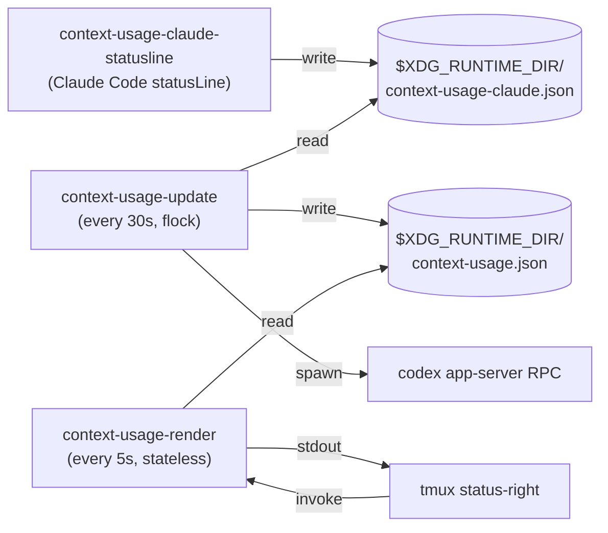

# context-usage-tmux

A tmux status-bar widget that shows your current Claude Code **context window
remaining** and Codex CLI **5-hour rolling-window usage** as compact bars on the
far right, with the Codex reset countdown and the date/time.

```
… [✱ ctx ██▒▒▒ 38%] [⏣ ███▒▒ 59% ⏰3h] 14:32 28-Apr
```

`✱` is Claude (orange), `⏣` is OpenAI/Codex (white) — single-glyph stand-ins
for each vendor's logo, drawn in their brand color. The percent shown is how
much is **remaining** — full bar = full tank.

Same idea as the macOS menu-bar widgets (Usage4Claude, ClaudeBar, AIQuotaBar) —
but native to tmux, shell-only, no menu bar required.

## Install

One line in `~/.config/tmux/tmux.conf` after your other config:

```
run-shell "/path/to/context-usage-tmux/tmux/context-usage.tmux"
```

Reload tmux (`prefix + r` or `tmux source-file ~/.config/tmux/tmux.conf`).
The widget appears on the far right of the status bar within ~30s.

Claude context usage comes from Claude Code's official `statusLine` payload.
Add this to `~/.claude/settings.json`, using this repository's absolute path:

```json
{
  "statusLine": {
    "type": "command",
    "command": "/path/to/context-usage-tmux/bin/context-usage-claude-statusline",
    "refreshInterval": 30
  }
}
```

## Requirements

- tmux ≥ 3.2
- Claude Code with `statusLine` support, `jq`, `flock`, `awk`, `date` (GNU coreutils)
- `codex` CLI (≥ 0.125) on `$PATH` — used to query Codex's rate-limit RPC

## How it works

Data sources, both local — no credentials handled by this project:

- **Claude**: Claude Code's official `statusLine` stdin JSON. The bridge script
  caches `context_window.remaining_percentage` locally for tmux.
- **Codex**: a one-shot `codex app-server` subprocess speaking the
  `account/rateLimits/read` JSON-RPC. Returns the same primary/secondary
  rate-limit windows the Codex TUI shows in its status bar.

Two scripts split across the slow/fast boundary:



- **Claude bridge** (`bin/context-usage-claude-statusline`) — receives Claude
  Code's statusLine JSON and writes `$XDG_RUNTIME_DIR/context-usage-claude.json`.
- **Updater** (`bin/context-usage-update`) — long-running, single-instance via
  `flock`. Polls every 30s, writes JSON to `$XDG_RUNTIME_DIR/context-usage.json`.
- **Renderer** (`bin/context-usage-render`) — stateless, reads the cache, prints
  one line for `status-right`. ~60ms per render.

The `tmux/context-usage.tmux` entry point spawns the updater and prepends the
renderer to your existing `status-right`. It's idempotent — re-sourcing the
config doesn't double-up.

See [`docs/architecture.md`](./docs/architecture.md) for the full design notes.

## Reading the bar

```
[✱ ctx ██▒▒▒ 38%]
 │  │   │     │
 │  │   │     └── percent of Claude context *remaining* (38 = 38% left)
 │  │   └──────── filled cells (each cell = 1/WIDTH of the remaining context)
 │  └──────────── metric label: ctx = context window
 └─────────────── tag: ✱ = Claude (orange), ⏣ = Codex/OpenAI (white)
```

Codex keeps the reset countdown because it is a rate-limit window. Claude
context usage has no reset countdown, so it only shows remaining context.

Color thresholds (on percent **remaining**): green >50%, yellow 20–50%,
red ≤20% (almost out).

If you see `[✱ —] [⏣ —]`, the cache is missing or stale (>2 min old) —
usually means the updater died. Check `pgrep -fa context-usage-update`.

If Claude shows `[✱ ?]`, Claude Code has not refreshed the statusLine bridge
recently. Check `~/.claude/settings.json`, then send a Claude prompt or restart
Claude Code so it runs `bin/context-usage-claude-statusline`.

If Codex shows `[⏣ ?]`, the `codex` CLI isn't on `$PATH` or its
`account/rateLimits/read` RPC didn't respond — install codex ≥ 0.125 or
override the binary location with `CODEX_BIN=/path/to/codex`.

If your terminal font lacks `✱`/`⏣`/`█`/`▒`, set `CU_PLAIN=1` in the
environment for an ASCII-safe fallback (`C`/`G`/`#`/`-`).

## Configuration

Environment variables (read by the updater / renderer):

| Var                            | Default | Effect                                       |
| ------------------------------ | ------- | -------------------------------------------- |
| `CONTEXT_USAGE_REFRESH_SECS`   | `30`    | How often the updater refreshes the cache    |
| `CONTEXT_USAGE_CLAUDE_STALE_SECS` | `180` | Claude statusLine cache age before showing `?` |
| `CONTEXT_USAGE_BAR_WIDTH`      | `5`     | Bar width in cells                           |
| `CU_STALE_AFTER_SECS`          | `120`   | Cache age past which renderer shows fallback |
| `CODEX_BIN`                    | `codex` | Codex CLI binary used for the rate-limit RPC    |
| `CODEX_HOME`                   | `~/.codex` | Reserved for future on-disk fallbacks         |

## Verification

```sh
./test/data-layer.sh    # lib/* return contract-shaped JSON
./test/updater.sh       # --once writes cache; flock enforces single instance
./test/renderer.sh      # fresh / stale / missing cache all render correctly
```

Or run the bundled smoke runner:

```sh
./test/all.sh
```

## License

MIT — see [`LICENSE`](./LICENSE).
