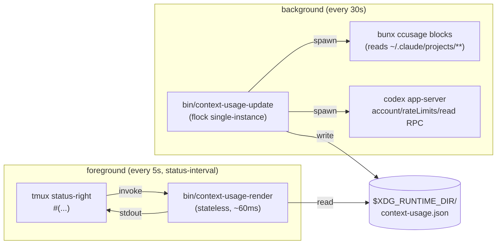

# Architecture

`context-usage-tmux` has two halves that never share memory: a **background
updater** that polls the slow data sources, and a **stateless renderer** that
tmux invokes ~every 5s to print one line. They communicate through a single
JSON cache file in `$XDG_RUNTIME_DIR`.



## Why the split

The renderer is on tmux's hot path — anything it does delays the status bar
redraw. `bunx ccusage` cold-starts in 1–3s and `codex app-server` takes
~1.5s for its JSON-RPC roundtrip. Doing either in the renderer would make
tmux feel laggy every 5s.

So the renderer never calls them. It opens one file, runs a few `jq`
queries, prints, exits. The slow work happens out-of-band in the updater,
which writes a fresh cache atomically every 30s.

## Single-instance updater

The updater holds an exclusive `flock` on
`$XDG_RUNTIME_DIR/context-usage.lock`. Sourcing the tmux entry point twice
(reload, second tmux server, etc.) spawns a second updater process, but
the flock makes it exit immediately as a no-op. `pgrep -fa
context-usage-update` should always show exactly one effective process.

## Staleness fallback

The renderer treats the cache as stale if `updated_at` is older than
`CU_STALE_AFTER_SECS` (default 120s). When stale or missing, it prints
`[✱ —] [⏣ —]` instead of guessing — usually the updater died or the
machine just woke from sleep. The next updater tick (within 30s) heals
it.

## Cache schema

```json
{
  "updated_at": 1745851234,
  "claude": {
    "percent": 62,
    "reset_epoch": 1745859274,
    "ok": true,
    "estimated": true
  },
  "codex": {
    "percent": 41,
    "reset_epoch": 1745862834,
    "ok": true,
    "estimated": false
  }
}
```

`percent` is **percent used** (0–100). The renderer flips it to
"remaining" for display so a full bar means a full tank.

`estimated: true` adds a `~` next to the tag glyph. Claude carries it
because ccusage's limit is heuristic (max ever seen, not the official
plan limit). Codex doesn't — its values come straight from the
`account/rateLimits/read` RPC.

## Data sources

| Vendor | Source | Notes |
| ------ | ------ | ----- |
| Claude | `bunx ccusage blocks --active --json` | Reads `~/.claude/projects/**/*.jsonl`. |
| Codex  | `codex app-server` JSON-RPC: `initialize` then `account/rateLimits/read` | Codex ≥ 0.125 moved state from JSONL to in-memory; only the app-server exposes it. |

Neither path touches the network or handles credentials — both data
sources are local files / processes the user already runs.
