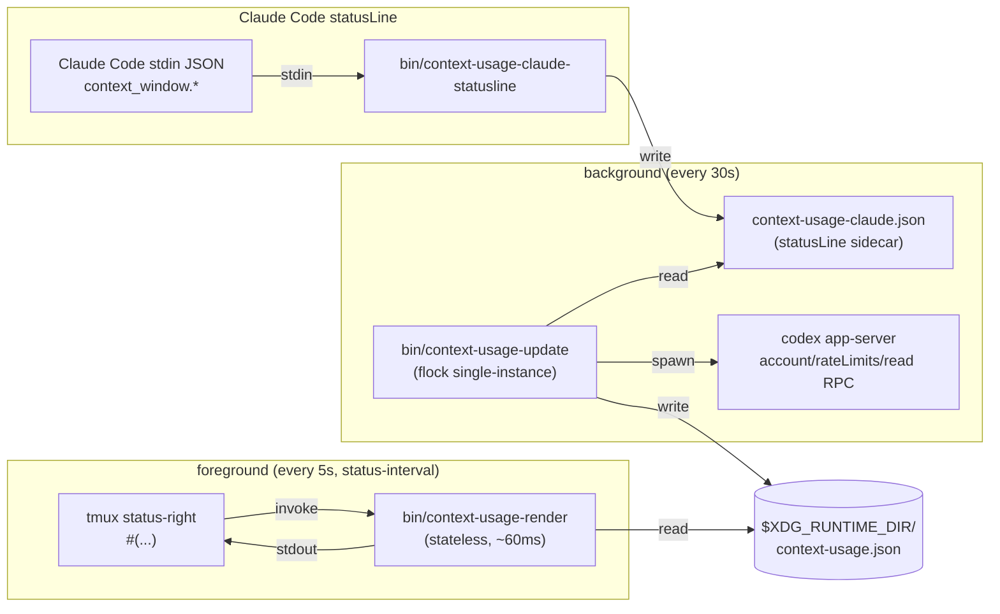

# Architecture

`context-usage-tmux` has three pieces that never share memory: a Claude Code
**statusLine bridge** that captures live context-window usage, a **background
updater** that polls the slow data sources, and a **stateless renderer** that
tmux invokes ~every 5s to print one line. They communicate through JSON cache
files in `$XDG_RUNTIME_DIR`.



## Why the split

The renderer is on tmux's hot path — anything it does delays the status bar
redraw. `codex app-server` takes ~1.5s for its JSON-RPC roundtrip, and Claude
context is only exposed to Claude Code statusLine commands. Doing either in the
renderer would make tmux feel laggy every 5s.

So the renderer never calls them. It opens one file, runs a few `jq` queries,
prints, exits. The slow work happens out-of-band in the updater, which writes a
fresh cache atomically every 30s. Claude context arrives through the statusLine
bridge whenever Claude Code refreshes its status line.

## Single-instance updater

The updater holds an exclusive `flock` on
`$XDG_RUNTIME_DIR/context-usage.lock`. Sourcing the tmux entry point twice
(reload, second tmux server, etc.) spawns a second updater process, but
the flock makes it exit immediately as a no-op. `pgrep -fa
context-usage-update` should always show exactly one effective process.

## Staleness fallback

The renderer treats the cache as stale if `updated_at` is older than
`CU_STALE_AFTER_SECS` (default 120s). When stale or missing, it prints
`[✱ —] [⏣ —]` instead of guessing — usually the updater died or the
machine just woke from sleep. The next updater tick (within 30s) heals
it.

## Cache schema

```json
{
  "updated_at": 1745851234,
  "claude": {
    "kind": "context",
    "percent": 62,
    "used_percent": 62,
    "remaining_percent": 38,
    "reset_epoch": 0,
    "ok": true,
    "estimated": false
  },
  "codex": {
    "percent": 41,
    "reset_epoch": 1745862834,
    "ok": true,
    "estimated": false
  }
}
```

`percent` is **percent used** (0–100). Claude also carries
`remaining_percent` from Claude Code's `context_window.remaining_percentage`.
The renderer shows remaining percent so a full bar means a full tank.

Claude has `kind: "context"` and no reset countdown. Codex uses the default
rate-limit rendering with a reset countdown from `account/rateLimits/read`.

## Data sources

| Vendor | Source | Notes |
| ------ | ------ | ----- |
| Claude | Claude Code `statusLine` stdin JSON | Uses `context_window.remaining_percentage` for live context left. |
| Codex  | `codex app-server` JSON-RPC: `initialize` then `account/rateLimits/read` | Codex ≥ 0.125 moved state from JSONL to in-memory; only the app-server exposes it. |

Neither path touches the network or handles credentials — both data
sources are local files / processes the user already runs.
