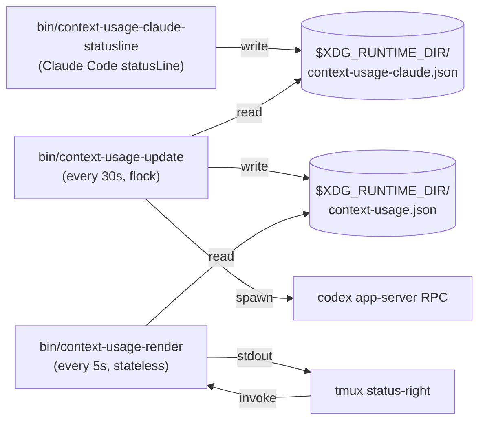

# Putting Claude Code and Codex usage in your tmux status bar

I keep two AI coding sessions open most of the day — Claude Code in one
pane, Codex CLI in another. Claude's context window fills up as a session
grows, Codex has a 5-hour rolling window, and both will happily let you run
into the wall without warning.

The macOS world solved this a while ago — Usage4Claude, ClaudeBar,
AIQuotaBar all live in the menu bar. None of them work for me, because I
live in tmux, and a menu bar widget I can't see while my terminal is
fullscreen is basically not there.

So: **`context-usage-tmux`**. One `run-shell` line, two compact bars on
the far right of your status bar:

```
[✳ ctx ██▒▒▒ 38%] [⏣ ███▒▒ 59% ⏰3h] 14:32 28-Apr
```

`✳` is Claude (orange), `⏣` is Codex (white). The percent is what's
**remaining** — full bar = full tank — and the color goes red as you run
out. Claude is context remaining; Codex keeps the `⏰` reset timer because
it is a rate-limit window.

## Why this is harder than it looks

Two annoyances dominated the implementation:

**Claude context is only live in Claude Code.** The JSONL logs are useful for
historical usage, but the live context-window percentage comes from Claude
Code's official `statusLine` stdin payload. The bridge script caches that
payload locally so tmux can show context remaining without blocking or
guessing.

**Codex 0.125 broke every JSONL-based scraper.** The Codex CLI used to
write rate-limit info into `~/.codex/sessions/**/*.jsonl`, which made
parsing trivial. Then 0.125 moved everything in-memory and out to a
SQLite store that doesn't include the rate-limit values. Tools like
`@ccusage/codex` silently report zeroes against this layout.

The fix: spawn `codex app-server` (the JSON-RPC subprocess the Codex TUI
already uses internally) and ask it `account/rateLimits/read`. You get
back the same primary/secondary window data the official UI shows. It's
~1.5s per call, which is fine — the updater runs in the background, not
on tmux's hot path.

## The architecture in one diagram

This is the whole project:



The renderer never calls a slow process. It reads one file, runs a few
`jq` queries, prints, exits. Cold-start is ~60ms. The updater holds a
`flock` so reloading tmux doesn't spawn a duplicate.

## Install

```sh
git clone git@github.com:bupd/context-usage-tmux.git ~/code/context-usage-tmux
```

Add one line to `~/.config/tmux/tmux.conf`:

```
run-shell "~/code/context-usage-tmux/tmux/context-usage.tmux"
```

Reload (`prefix + r`). The widget appears within ~30s.

Requirements: tmux ≥ 3.2, Claude Code with `statusLine` support, `jq`,
`flock`, GNU `date`, and `codex` CLI ≥ 0.125 if you want the Codex bar.

## What's next

A few obvious extensions I haven't built yet:

- **More vendors.** Cursor, Aider, OpenCode all expose usage somewhere.
  Each is a `lib/<vendor>.sh` away.
- **Daily/weekly bars.** The 5-hour window is the rate limit, but a lot
  of plans also have a softer monthly cap.
- **A `cu doctor` subcommand** for diagnosing why a bar isn't showing
  up (cache age, lockfile state, font support, etc.).

If you use it and something breaks, file an issue. If you want to add a
vendor, send a PR — `lib/claude.sh` is short and self-contained, copy
that pattern.

Code: <https://github.com/bupd/context-usage-tmux>. MIT.
